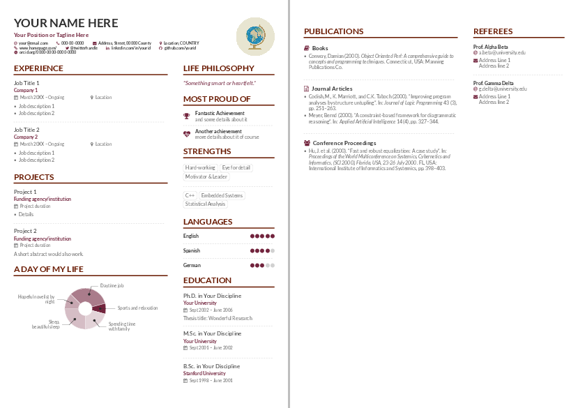

# AltaCV, yet another LaTeX CV/Résumé class

v1.1.3 (30 April 2017), by LianTze Lim (liantze@gmail.com)

(Thanks to [Nur](https://github.com/nurh) for the name.)

Personal version of LianZe Alta CV: https://github.com/liantze/AltaCV

## Samples

This is how the re-created résumé looks like

## Requirements and Compilation

* pdflatex + biber + pdflatex
* AltaCV uses [`fontawesome`](http://www.ctan.org/pkg/fontawesome) and [`academicons`](http://www.ctan.org/pkg/academicons); they're included in both TeX Live 2016 and MikTeX 2.9.
* Loading `academicons` is optional: enable it by adding the `academicons` option to `\documentclass`.
* Can now be compiled with pdflatex, XeLaTeX and LuaLaTeX!
* However if you're using `academicons`, you _must_ use either XeLaTeX or LuaLaTeX. If the doc then compiles but the icons don't show up in the output PDF, try compiling with LuaLaTeX instead.
* The samples here use the [Lato](http://www.latofonts.com/lato-free-fonts/) font.
